# 🕵️‍♂️ ProverbGap MCQ Pilot: Detective Forensic Audit Report

An in-depth, rigorous, and highly analytical audit of the unzipped `results (2).zip` and logs from the latest ProverbGap MCQ pilot run. This forensic report uncovers critical methodological vulnerabilities, silent engineering bugs, and structural data leakages that must be resolved to ensure a bulletproof, reviewer-proof submission for **EMNLP Findings**.

---

## 🚨 Critical Discoveries (The Detective Findings)

### 1. The Dead Committee Models & Silent 1.8-Hour Sleep Bug
Three out of the five models in the EMNLP Reviewer Committee were **failing silently on 100% of the API calls**!
* **Dead Models:** `gemma2-9b-it`, `mixtral-8x7b-32768`, and `llama-3.1-70b-versatile`.
* **The Root Cause:** These endpoints have been deprecated or disabled on Groq.
* **The Engineering Bug:** In `call_api()`, if a model returned a `400` or `404` error (because it doesn't exist), the script fell into an empty `else` block:
  ```python
  else: 
      time.sleep(2)
      continue
  ```
  It retried `max_retries = 12` times for **every single dead model, for every single question**. This resulted in **72 seconds of useless, silent sleeping** per audited item.
* **The Time Blowout:** For 90 items, this added **1.8 hours of dead time** per strategy audit!
  $$\text{Time Lost} = 90 \text{ items} \times 3 \text{ dead models} \times 12 \text{ retries} \times 2\text{s} = 6,480 \text{ seconds (1.8 hours)}$$
* **The Timeout:** This silent blowout is the **exact reason** why the Kaggle notebook exceeded the 12-hour limit and timed out before completing the `B-STRATEGY_2` audit!

> [!WARNING]
> Because the API calls returned `None`, the script silently logged their accuracy as `0.0%`. The consensus vote was computed using only the two remaining active models (`llama-3.1-8b-instant` and `llama-3.3-70b-versatile`), which severely compromised the statistical validity of the committee consensus.

---

### 2. The Silent Fallback Pollution (up to 73.3% Failure Rate)
If distractor generation or parsing failed for Strategy 2, the script quietly fell back to **Strategy 1 (unparaphrased negative sampling)**. Our forensic comparison against the original datasets revealed a massive, hidden fallback rate:

| Task / Strategy | English Fallback | Yoruba Fallback | Arabic Fallback | Overall Fallback Rate |
| :--- | :---: | :---: | :---: | :---: |
| **Task A (Literal) - Strategy 2** | 23.3% (7/30) | 46.7% (14/30) | 30.0% (9/30) | **33.3% (30/90)** |
| **Task B (Cultural) - Strategy 2** | **73.3% (22/30)** | 50.0% (15/30) | 50.0% (15/30) | **57.8% (52/90)** |

> [!CAUTION]
> **Methodological Flaw:** Strategy 2 is *not* a pure paraphrased strategy. In Task B, it is actually a hybrid where **57.8% of the data is unparaphrased negative sampling (Strategy 1)**!
>
> **Artificial Performance:** The low committee consensus accuracy of Strategy 2 in Yoruba (33.3%) was not because of excellent paraphrased distractors, but because **half of the items were actually Strategy 1**, which naturally enjoys high shortcut resilience. This is a massive confounder that reviewers would reject.

---

### 3. Lexical Length Leakage (Up to +19.1 Chars)
An audit of option lengths reveals a clear, exploitable length shortcut in Strategy 2:

```mermaid
gantt
    title Option Length Delta (Correct - Distractor) in Characters
    dateFormat  X
    axisFormat %s
    section Strategy 1 (Negative)
    Task A (Literal)    : active, 0, -1
    Task B (Cultural)   : active, 0, -2
    section Strategy 2 (LLM Gen)
    Task A (Literal)    : crit, 0, 3
    Task B (Cultural)   : crit, 0, 4
```



* **Strategy 1 (Pure Human Negative Sampling) is Bulletproof:**
  * **Task A Overall Delta:** **-1.1 chars** (Yoruba: -2.5, Arabic: +0.2, English: -0.9)
  * **Task B Overall Delta:** **-2.6 chars** (Yoruba: +2.0, Arabic: -4.0, English: -5.7)
  * There is almost zero length signature. This represents a highly resilient benchmark.
* **Strategy 2 (Style-Paraphrased Generation) has Major Leakage:**
  * **Task A English Delta:** **+7.4 chars** (Correct options are systematically longer, leading to a high 50% committee detection rate).
  * **Task B Arabic Delta:** **+19.1 chars** (The correct cultural meaning is on average **19.1 characters longer** than the generated distractors!).

> [!IMPORTANT]
> The source database contains extremely long cultural explanations for Arabic proverbs. When the generator paraphrased them, it preserved their length, but generated distractors that were much shorter. This gives the models an immediate, simple shortcut (pick the longest answer) to solve the benchmark.

---

## 📊 Comprehensive Audit Matrix

Here is the combined forensic grid of the active results from the unzipped pilot:

| Task / Strategy | Language | Fallback Rate | Length Delta | Llama-3.1 8B | Llama-3.3 70B | Consensus Accuracy | Pass / Fail Status |
| :--- | :--- | :---: | :---: | :---: | :---: | :---: | :---: |
| **A - STRATEGY 1** | English | 0.0% | -0.9 chars | 33.3% | 23.3% | **33.3%** | ✅ **PASS** (High Resilience) |
| *(Literal, Negative)* | Yoruba | 0.0% | -2.5 chars | 30.0% | 26.7% | **33.3%** | ✅ **PASS** (High Resilience) |
| | Arabic | 0.0% | +0.2 chars | 30.0% | 23.3% | **26.7%** | ✅ **PASS** (High Resilience) |
| **A - STRATEGY 2** | English | 23.3% | **+7.4 chars** | 46.7% | 53.3% | **50.0%** | 🔴 **FAIL** (Length Leakage) |
| *(Literal, LLM Paraphrase)*| Yoruba | 46.7% | +2.5 chars | 33.3% | 36.7% | **33.3%** | 🟡 **REVIEW** (Confounded by Fallback) |
| | Arabic | 30.0% | 0.0 chars | 53.3% | 70.0% | **66.7%** | 🔴 **FAIL** (Stylistic Leakage) |
| **B - STRATEGY 1** | English | 0.0% | -5.7 chars | 23.3% | 26.7% | **30.0%** | ✅ **PASS** (High Resilience) |
| *(Cultural, Negative)*| Yoruba | 0.0% | +2.0 chars | 23.3% | 23.3% | **26.7%** | ✅ **PASS** (High Resilience) |
| | Arabic | 0.0% | -4.0 chars | 16.7% | 30.0% | **26.7%** | ✅ **PASS** (High Resilience) |
| **B - STRATEGY 2** | English | **73.3%** | -7.7 chars | *N/A* | *N/A* | *Timed Out* | 🔴 **UNRESOLVED** (API Timeout) |
| *(Cultural, LLM Paraphrase)*| Yoruba | **50.0%** | +0.7 chars | *N/A* | *N/A* | *Timed Out* | 🔴 **UNRESOLVED** (API Timeout) |
| | Arabic | **50.0%** | **+19.1 chars** | *N/A* | *N/A* | *Timed Out* | 🔴 **UNRESOLVED** (API Timeout) |

---

## 🛠️ Action Plan: Concrete Engineering Upgrades

To make the ProverbGap MCQ pipeline highly robust, fast, and reviewer-proof, we must execute the following 3-step upgrade in the Kaggle notebook:

### Step 1: Repair the 5-Model Committee
Replace the dead models with active, modern endpoints and eliminate the silent retry bug:
* **Active EMNLP Reviewer Committee (N=5):**
  1. `llama-3.3-70b-versatile` (Active)
  2. `llama-3.1-8b-instant` (Active)
  3. `deepseek-r1-distill-llama-70b` (Active - outstanding reasoning)
  4. `llama-3.2-11b-vision-preview` (Active)
  5. `llama-3.2-3b-preview` (Active)
* **Safe Error Handling:** Add an explicit exception raise or stderr warning when a model returns `None` after retries, preventing 10-hour silent runs.

### Step 2: Scale-Up Rate Limit Mitigation
Introduce a smart, token-bucket rate limiter that actively coordinates parallel requests, rather than sleeping naively. Groq free accounts have strict RPM limits.
* **Audit Delay:** Add `time.sleep(1.0)` between model calls during the audit loop.
* **Multi-Key Rotation:** Hardcode or load multiple API keys to rotate between requests, which is already partially supported but needs to be rigorously expanded.

### Step 3: Hardening Strategy 2 distractor Phrasing
We must neutralize the length leakage by forcing the generator to match the character count of the correct answer:
* **Prompt Injection:** Add a strict length-matching instruction:
  > `"Options 2, 3, and 4 MUST be within 10% of the character count of Option 1 (Option 1 is X characters long). Do not make distractors shorter than the correct paraphrase."`
* **Length Truncation / Padding:** Implement a validation loop in python that rejects generated distractors if they deviate from the correct option's length by more than 15%, forcing a regenerate.

---

### Next Steps & Feedback
I have already placed two diagnostic scripts in your folder:
1. `c:\Users\User\Downloads\THe proverbeval container\MCQ\new_last_run\new_last\analyze_results.ps1` — Calculates precision metrics.
2. `c:\Users\User\Downloads\THe proverbeval container\MCQ\new_last_run\new_last\analyze_lengths.ps1` — Audits option character length deltas.

We are now ready to implement these upgrades in [proverbgap-pilot-v2.ipynb](file:///c:/Users/User/Downloads/THe%20proverbeval%20container/MCQ/proverbgap-pilot-v2.ipynb) or write a local patch script. Please let me know how you would like to proceed!
